# DIAGRAMS

## Ad hoc 

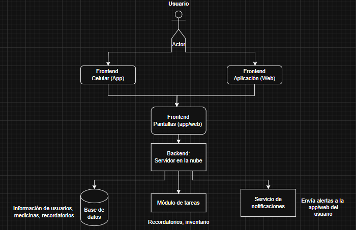

## Use case

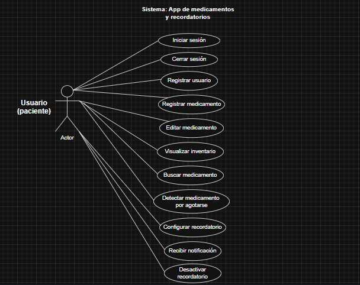

## Sequence diagrams

## -Sequence diagram IS

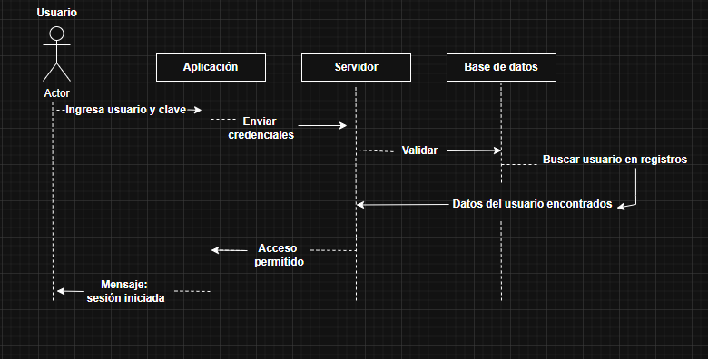

## -Sequence diagram RU

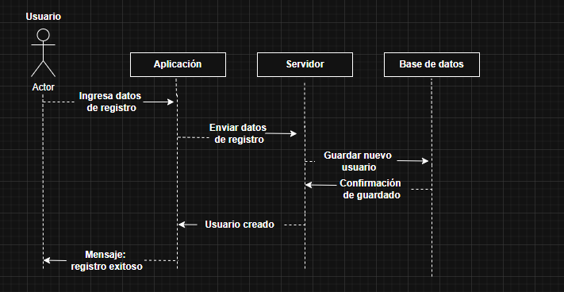

## -Sequence diagram CS

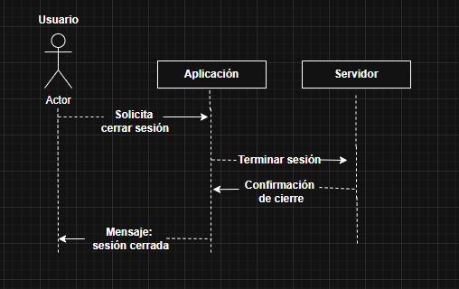

## -Sequence diagram RM 

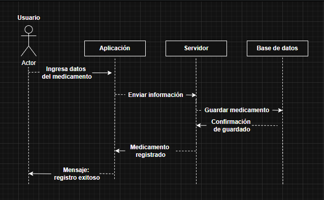

## -Sequence diagram EM

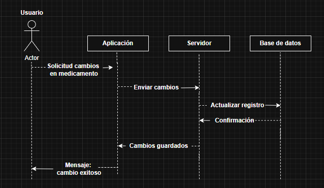

## -Sequence diagram VI

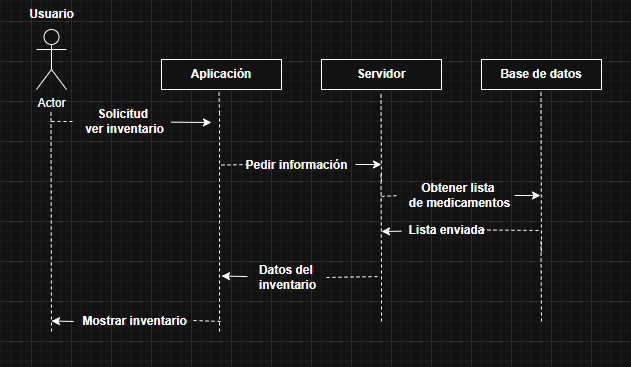

## -Sequence diagram BM

## -Sequence diagram MA 

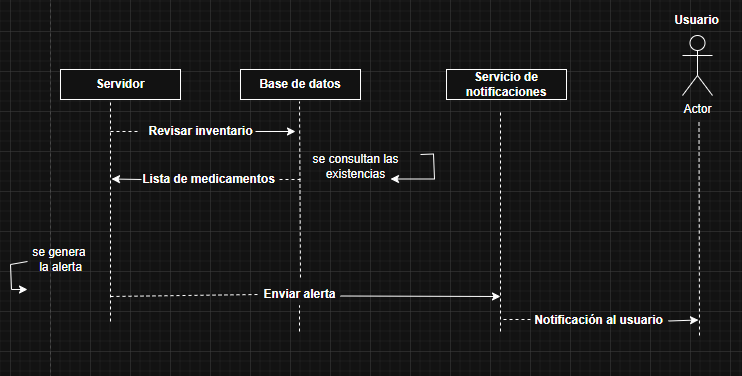

## -Sequence diagram CR

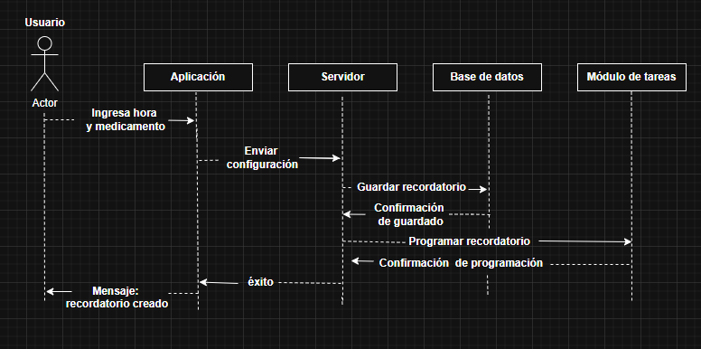

## -Sequence diagram RN

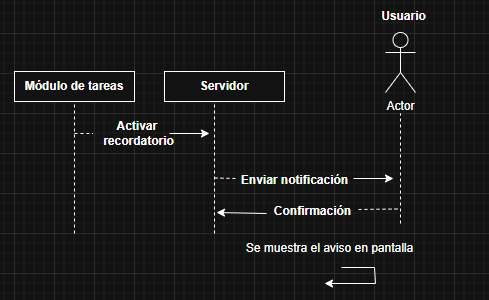

## -Sequence diagram DR

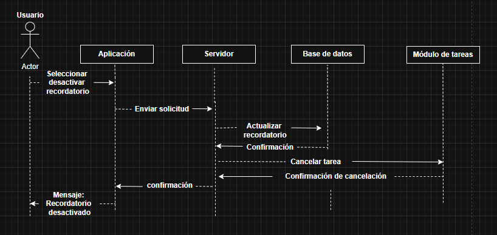

## Relational model diagram

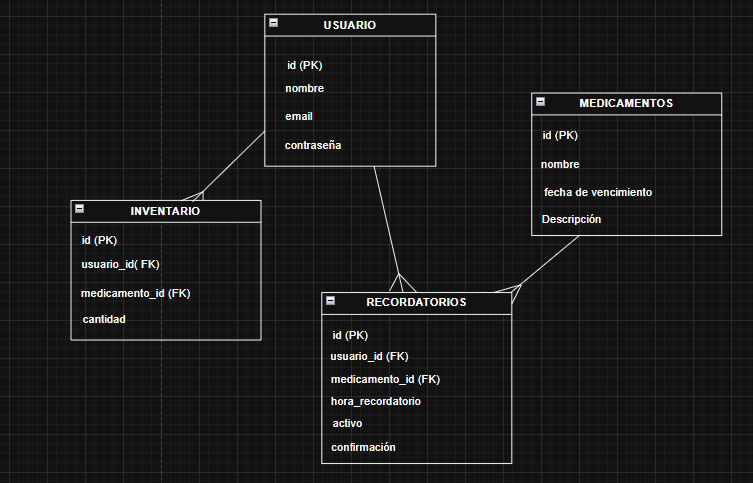

## Component diagram

